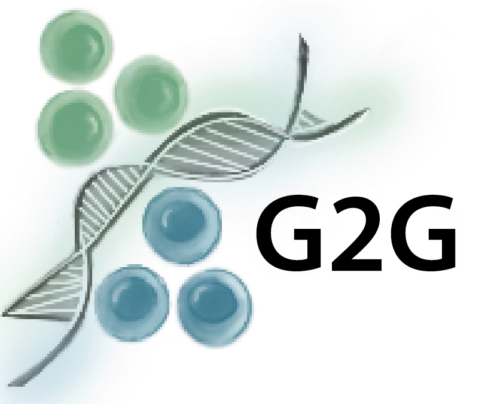
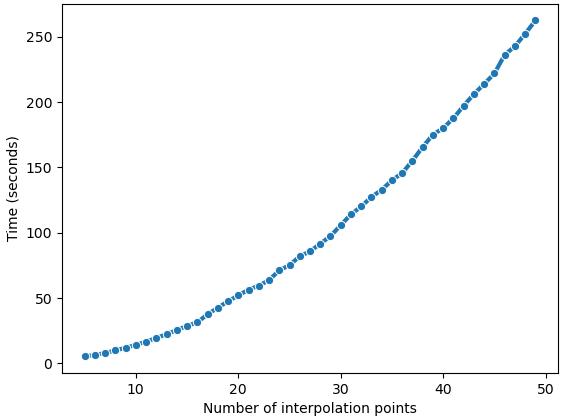
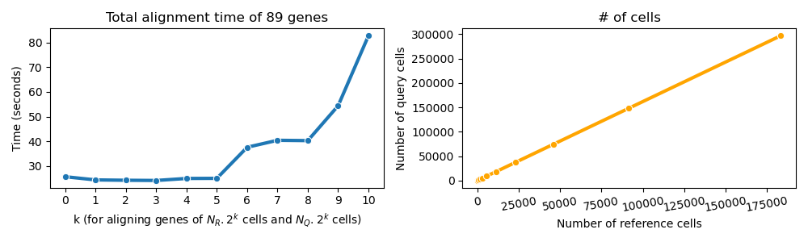

# Genes2Genes
Project page: https://teichlab.github.io/Genes2Genes

## A new framework for aligning single-cell trajectories of gene expression 
G2G aims to guide downstream comparative analysis of single-cell reference and query systems along any axis of progression (e.g. pseudotime). 
This is done by employing a new dynamic programming (DP) based alignment algorithm which unifies dynamic time warping (DTW) and gap modelling to capture both matches and mismatches between time points. Our DP algorithm 
incorporates a Bayesian information-theoretic scoring scheme with a five-state probabilistic machine to generate an optimal alignment between a reference trajectory and query trajectory of a given gene in terms of their scRNA-seq expression. 

We can use the G2G framework to perform comparisons across pseudotime such as:
<ul>
    <li>Organoid vs. Reference tissue
    <li>Control vs. Treatment
    <li>Healthy vs. Disease
</ul>  
by inferring fully-descriptive gene-specific alignments and single-aggregate alignments. 
These alignment results enable us to pinpoint dynamic similarities and differences in gene expression between a reference and query, as well as to group genes with similar alignment patterns.  

### Manuscript preprint 
***"Gene-level alignment of single cell trajectories"*** <br>
**Authors**: Dinithi Sumanaweera†, Chenqu Suo†, Ana-Maria Cujba, Daniele Muraro, Emma Dann, Krzysztof Polanski, Alexander S. Steemers, Woochan Lee, Amanda J. Oliver, Jong-Eun Park, Kerstin B. Meyer, Bianca Dumitrascu, Sarah A. Teichmann* <br>
Available at: https://doi.org/10.1101/2023.03.08.531713 

### **Installing G2G**

For now, G2G needs to be installed from GitHub in a Python >=3.8 environment. We recommend creating a new Conda environment before installing G2G, to avoid any version conflicts and dependency issues.
```bash
conda create --name g2g_env python=3.8 
conda activate g2g_env
pip install git+https://github.com/Teichlab/Genes2Genes.git
```
The package will be made available on PyPi soon.

### **Input to G2G**
(1) Reference anndata object (with `adata_ref.X` storing log1p normalised gene expression), 
(2) Query anndata object (with `adata_query.X` storing log1p normalised gene expression), and
(3) Pseudotime estimates stored in each anndata object under `adata_ref.obs['time']` and `adata_query.obs['time']`.

**Note:** Please ensure that you have reasonable pseudotime estimates that fairly represent the trajectories, as the accuracy and reliability of trajectory alignment entirely depend on the accuracy and reliability of your pseudotime estimation. We recommend users to inspect whether the cell density distribution along estimated pseudotime (in terms of the meta attributes such as the annotated cell type, sampling time points, etc. where applicable) well-represents each trajectory of focus. Users can choose the best pseudotime estimates to compare after testing several different pseudotime estimation tools on their datasets. 

### **Tutorial**

Please refer to the notebook [`notebooks/Tutorial.ipynb`](https://github.com/Teichlab/Genes2Genes/blob/main/notebooks/Tutorial.ipynb) which gives an example analysis between a reference and query dataset from literature. 
Please also refer https://teichlab.github.io/Genes2Genes on how to read a trajectory alignment output generated by G2G. <br>

### **Runtime**

The runtime of the G2G algorithm depends on the number of cells in the reference and query datasets, the number of interpolation time points, and the number of genes to align. 
For an idea, please see below a simple run-time analysis of G2G for 89 genes of the reference (N<sub>R</sub> = 179 cells) and query (N<sub>Q</sub> = 290 cells) from literature used in our tutorial. Note: the number of interpolation points = 14 for the middle plot. 
(Reference: [`notebooks/Supplementary_notebook1.ipynb`](https://github.com/Teichlab/Genes2Genes/blob/main/notebooks/Supplementary_notebook1.ipynb))

<div style="display: flex; justify-content: space-between;">
    <p align="center">
    
    
    </p>
</div><br>


**Further examples from the case studies of our manuscript:** 
(Reference: [`notebooks/Supplementary_notebook2.ipynb`](https://github.com/Teichlab/Genes2Genes/blob/main/notebooks/Supplementary_notebook2.ipynb))

It took approximately 12min to align 1371 gene trajectories of 20,327 reference cells & 17,176 query cells under 14 interpolation time points; and approximately 4.5min to align 994 gene trajectories of 3157 reference cells & 890 query cells under 13 interpolation time points. 

G2G can also utilize concurrency through Python multiprocessing by creating a number of processes equal to the number of cores in the system where each process performs a single gene-level alignment at one time. However we note that sequential processing (the default setting of G2G) seems to be more efficient than parallel processing, as multiprocessing seems to add an overhead when allocating and sharing resources amongst processes, thus doubling up the runtime. 


### Funding Acknowledgement
Marie Skłodowska-Curie grant agreement No: 101026506 (Marie Curie Individual Fellowship) under the European Union’s Horizon 2020 research and innovation programme; Wellcome Trust Ph.D. Fellowship for Clinicians; Wellcome Trust (WT206194); ERC Consolidator Grant (646794); Wellcome Sanger Institute’s Translation Committee Fund.
