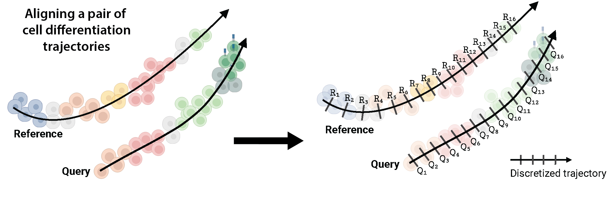
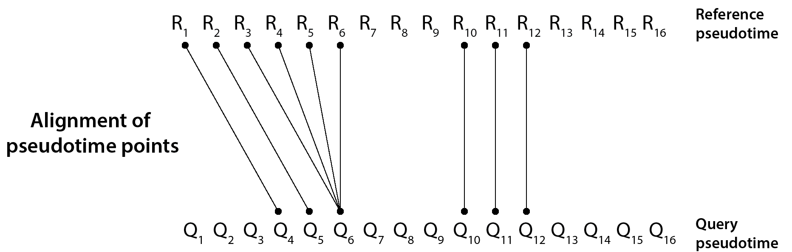
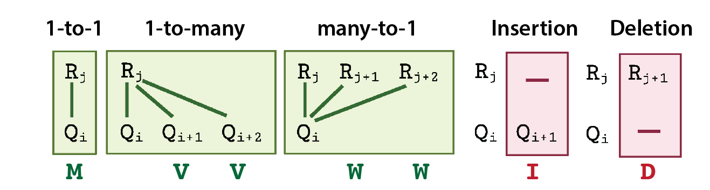
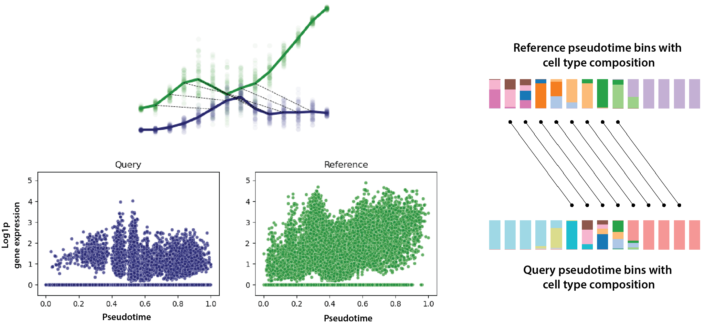

.. Genes2Genes documentation master file, created by
   sphinx-quickstart on Wed Aug 16 09:01:25 2023.
   You can adapt this file completely to your liking, but it should at least
   contain the root `toctree` directive.

Genes2Genes
=======================================

**A framework for single-cell pseudotime trajectory alignment** 

.. contents:: Contents

Genes2Genes (G2G) is a new Python framework for aligning single-cell pseudotime trajectories of gene expression between any reference and query for a pairwise comparison such as:

    * Organoid vs. Reference tissue
    * Control vs. Treatment
    * Healthy vs. Disease
    
Trajectory alignment: What & Why?
###########

A single-cell trajectory describes the transcriptomic state of cells along some axis of progression (such as time), due to undergoing some dynamic process (e.g. cell differentiation, treatment response, or disease infection). Given an scRNA-seq profile, there are various tools available today to infer such trajectory by estimating a pseudo ordering of the cells along an axis, commonly referred to as 'pseudotime'. The pseudotime axis of a trajectory can be descritized to represent it as a sequence of discrete time points. Given two such discrete pseudotime sequences of two trajectories, a pairwise alignment between them defines a non-linear mapping between their time points. This mapping could have 1-to-1  matches as well as 1-to-many/many-to-1 matches (a.k.a warps) between the time points, while unmapping the time points which have significantly different transcriptomic states. Below is an example visualization of two cell differentiation trajectories. 

For two trajectories representing single lineages as above, G2G generates an **optimal pairwise trajectory alignment** that captures the matches and mismatches between their time points in sequential order, allowing a user to quantify the degree of similarity between them.

| 
G2G defines 5 different states of alignment between any two **R** and **Q** time points, corresponding to all possible match and mismatch states. They are: 1-to-1 match (``M``), 1-to-many match (``V``), many-to-1 match (``W``), insertion (``I``) and deletion (``D``). Here, ``I`` or ``D`` refer to a mismatched time point in Q or R, respectively. These states jointly cover the alignment states defined in classical dynamic time warping and biological sequence alignment. 

|
Accordingly, we can describe any trajectory alignment as a 5-state alignment string. For example, the 5-state alignment string of the above illustrated trajectory alignment is:

.. code-block:: 

   IIIMMMWWWIIIDDDMMMIIIIDDDD

This G2G alignment string enables us to identify the time regions of match and mismatch along the trajectories. For instance, we can interpret the above illustrated alignment as follow -- *R and Q trajectories have mid and late mismatches, with the early stage of Q being mismatched, yet starting to match to the early stage of R at the middle of Q's trajectory. Overall, there are 9 R and Q pseudotime pairs getting matched (with 34.62% alignment similarity)*. 

Outputs from Genes2Genes
###########

Given an scRNA-seq dataset with their pseudotime estimates and a specified set of genes (e.g. all transcription factors, highly variable genes, biological/signaling pathway genes), G2G generates fully-descriptive alignments for each gene (i.e. **gene-level alignment**), as well as an average (aggregate) alignment (i.e. **cell-level alignment**) across all genes. 

Below is an example gene-level alignment of the gene *JUNB* in T cell differentiation between a pan-fetal reference and an artificial thymic organoid system:

|
.. code-block:: 

    IIIIIDMMMMMMMMIDDDDD 

Each gene-level alignment carries its 5-state string, an alignment similarity percentage statistic,  and the optimal alignment cost (in *nits* -- the unit measure of information). For the above gene, the aligment similarity is 40%, and the total cost of alignment is 53.47 nits. When the degree of difference in gene expression  between the reference and query  is high, the alignment cost will also be high. 

G2G uses the inferred gene-level alignments to inform:

#. **The degree of similarity between the two profiles** as an average percentage of alignment similarity across all the genes tested,
#. **An aggregate cell-level alignment across all genes** to inform the average states of match and mismatch between the two profiles (again represented by a 5-state string),  
#. **A ranked list of genes across time (from the most distant to most similar)** based on their alignment similarity percentage statistic,
#. **The diversity of different alignment patterns in genes**, by clustering gene-level alignments to identify different matching and mismatching patterns along time,

between the two single-cell reference and query profiles in comparison. 

For further downstream analysis, G2G provides a wrapper function to check gene-set overrepresentation analysis of the identified gene-clusters and the list of the top distant (differentially-expressed) genes across time, using  `GSEApy <https://github.com/zqfang/GSEApy>`_ Enrichr interface. The user is also able to compute an average alignment across any gene subset of their interest.

**Note**: G2G has been developed only for single-lineage trajectory comparison. In the case of a trajectory with multiple branches, we recommend separating out the singe-lineage branches before any pairwise comparison.

Our approach to trajectory alignment
###########

We employ a **dynamic programming** (DP) based algorithm that can capture both matches and mismatches in gene expression in a unified way. This combines the classical **Gotoh's algorithm** for biological sequence alignment with **dynamic time warping**. Our DP algorithm uses a **Bayesian information-theoretic scoring scheme** based on the **minimum message length** criterion to generate an optimal alignment between two gene trajectories. This scheme  evaluates the distributional similarity of gene expression between R and Q for each pair of time points, in terms of both their mean and variance of expression modelled as Gaussian distributions.
For more details on the methods, please see our `manuscript <https://doi.org/10.1101/2023.03.08.531713>`_. 

Getting started
===========

For now, G2G needs to be installed from GitHub:

.. code-block:: shell

   pip install git+https://github.com/Teichlab/Genes2Genes.git
   
The package will be made available soon on PyPi. 

**Input to Gene2Genes**

G2G takes reference and query input data as ``anndata`` objects, where each ``adata`` object has:

* log1p normalised gene expression stored at ``adata.X`` 
* pseudotime estimates of the cells stored as ``adata.obs['time']``

The user can estimate pseudotime of the cells in their datasets  using any suitable method available (such as `Diffusion pseudotime <https://scanpy.readthedocs.io/en/stable/generated/scanpy.tl.dpt.html>`_, `CellRank <https://github.com/theislab/cellrank>`_, `Palantir <https://github.com/dpeerlab/Palantir>`_,  `GPLVM <https://pyro.ai/examples/gplvm.html>`_ etc.).
For better visualisation and interpretation of the alignment results, we recommend the data to be annotated with their cell types (manually and/or using an automatic annotation tool such as `CellTypist <https://www.celltypist.org>`_). 

Please refer to our Tutorial for an example analysis between a reference and query dataset from literature.

Citing Genes2Genes
===========
Our manuscript is currently available as a `preprint <https://doi.org/10.1101/2023.03.08.531713>`_ at bioRxiv: 

*Sumanaweera, D., Suo, C., Cujba, A.M., Muraro, D., Dann, E., Polanski, K., Steemers, A.S., Lee, W., Oliver, A.J., Park, J.E. and Meyer, K.B., 2023.* **Gene-level alignment of single cell trajectories informs the progression of in vitro T cell differentiation**. *bioRxiv, pp.2023-03.*

.. toctree::
   :hidden:
   
   self
